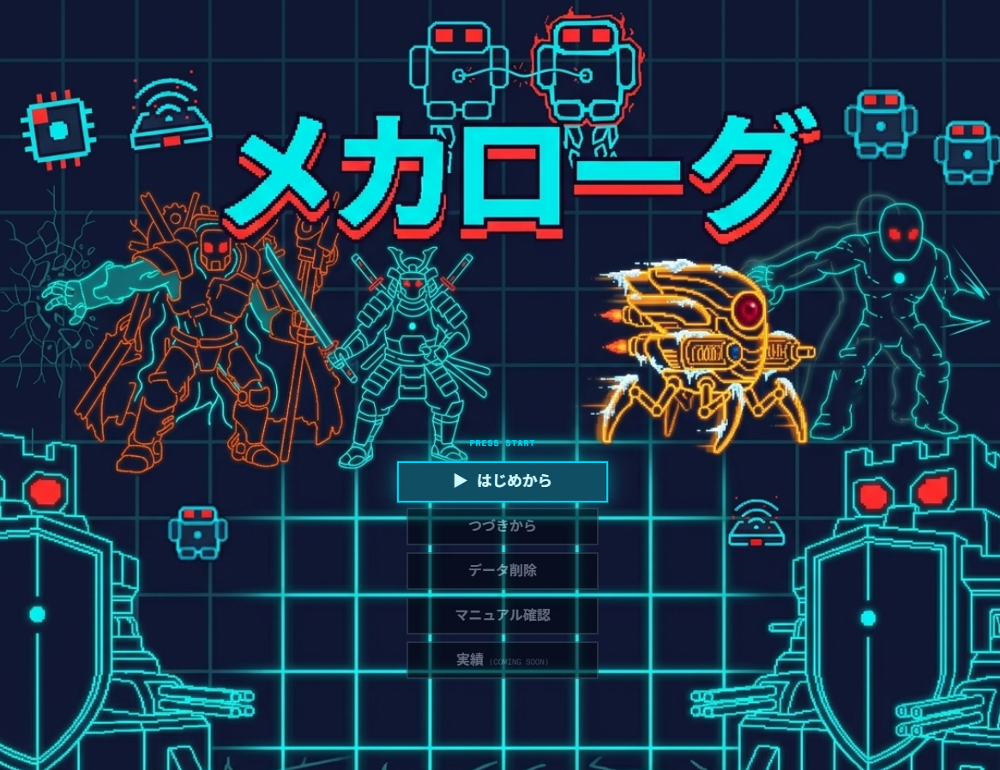

# メカローグ

Game URL(Vercel): https://mecha-rogue.vercel.app/

※ Claude Code により実装したゲームです。


ターン制2Dローグライクゲーム。メカマシンに搭乗し、ランダム生成される多層迷宮を探索して最深部（50階）を目指す。

## ゲーム概要

- **ジャンル**: ターン制ローグライク
- **プレイ環境**: ブラウザ（PC・スマートフォン対応）
- **入力**: キーボード（WASD / 矢印キー）＋マウス / タッチ操作
- **セーブ**: オートセーブ

### コアループ

```
探索 → 戦闘 → アイテム取得 → マシン強化 → 階段発見 → 次階層へ
  ↑                                                    ↓
  ← ← ← 撃破（スタート帰還）← ← ← ← ← ← ← ← ← ← ← ←
```

### マップ仕様

| 階層 | マップサイズ |
|------|------------|
| 1〜5F | 25×25 タイル |
| 6〜10F | 30×30 タイル |
| 11〜20F | 35×35 タイル |
| 21〜30F | 40×40 タイル |
| 31F〜 | 45×45 タイル |

ボスは 2F / 4F / 5F / 7F / 9F / 10F / 15F / 20F / 25F / 30F / 35F / 40F / 50F に出現。

## 技術スタック

- **フレームワーク**: Next.js 16 (App Router)
- **言語**: TypeScript (strict)
- **描画**: Canvas 2D
- **音声**: Tone.js（チップチューン）
- **スタイル**: Tailwind CSS v4
- **テスト**: Vitest
- **デプロイ**: Vercel

## ディレクトリ構成

```
src/
  game/
    core/       # コアロジック（迷路生成・ターン・戦闘・セーブ等）
    entities/   # エンティティ定義
    systems/    # 各種システム（audio / renderer / input 等）
    ui/         # React UI コンポーネント
    assets/
      data/     # JSON ゲームデータ（武器・敵・ボス等）
public/
  sprites/      # ドット絵スプライト（PNG）
tests/          # テスト
scripts/        # ビルド・生成スクリプト
docs/           # ゲームデザインドキュメント（HTML）
```

## セットアップ

```bash
npm install
npm run dev
```

[http://localhost:3000](http://localhost:3000) をブラウザで開く。

## その他コマンド

```bash
npm run build   # 本番ビルド
npm run lint    # Lint
npx vitest      # テスト実行
```

## ドキュメント

詳細なゲームデザインは [game-design.md](game-design.md) 、各ボスの仕様は [docs/全ボス.html](docs/全ボス.html) を参照。

## 利用規約

- 本ゲームは個人・非商用目的での無償プレイを許可します。
- ゲーム内コンテンツ（画像・音声・コード）の無断転載・再配布・商用利用を禁止します。
- 本ゲームの利用により生じた損害について、作者は一切の責任を負いません。
- 予告なく内容変更・公開停止を行う場合があります。

## プライバシーポリシー

本ゲームはユーザーの個人情報を一切収集しません。セーブデータはブラウザのローカルストレージにのみ保存されます。

## 年齢制限

年齢制限なし。ロボット同士の戦闘を題材としており、暴力表現は軽微です。

## ライセンス

本ゲームは以下のオープンソースライブラリを使用しています。

| ライブラリ | ライセンス |
|---|---|
| [Next.js](https://github.com/vercel/next.js/blob/canary/LICENSE) | MIT |
| [React](https://github.com/facebook/react/blob/main/LICENSE) | MIT |
| [TypeScript](https://github.com/microsoft/TypeScript/blob/main/LICENSE.txt) | Apache-2.0 |
| [Tone.js](https://github.com/Tonejs/Tone.js/blob/dev/LICENSE.md) | MIT |
| [Tailwind CSS](https://github.com/tailwindlabs/tailwindcss/blob/main/LICENSE) | MIT |
| [Vitest](https://github.com/vitest-dev/vitest/blob/main/LICENSE) | MIT |
